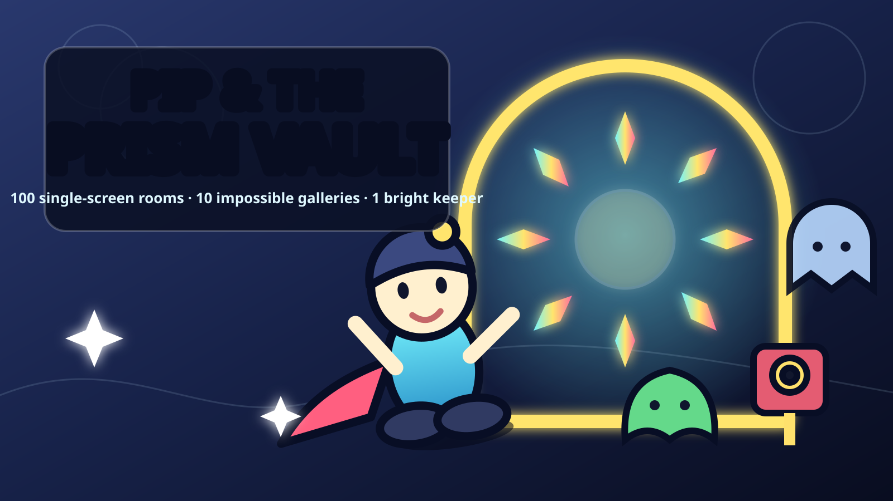

# Pip & the Prism Vault



**Pip & the Prism Vault** is the first game in the *Pip’s Pocket Worlds* series: a polished, single-screen puzzle arcade adventure inspired by the clarity and immediacy of classic 8-bit and 16-bit games, presented with original crisp cartoon vector art, fluid animation, responsive UI, adaptive music, sound effects, and visual effects.

The first-pass campaign is fully playable in a modern browser and contains **100 deterministic rooms across ten themed chapters**. There are no external stock assets or temporary placeholders. Character art, enemies, tiles, UI, key art, comic panels, music, SFX, and VFX are all original and generated by the game’s production code or supplied as editable SVG assets.


## The game

Pip is the smallest Sparkkeeper in the Prism Vault. When Baron Null steals the Prism Heart and scatters its light through ten impossible museum wings, Pip must recover every Spark and restore the Vault one room at a time.

Each room is a compact deterministic puzzle. Collect all three Prism Sparks, manipulate the room’s mechanisms, read enemy movement patterns, and reach the lift. Movement is turn-based but rendered with smooth tweening, animated characters, particles, screen effects, reactive audio, and readable telegraphing.

### Campaign scope

- 100 single-screen rooms, grouped into ten chapters of ten rooms
- Ten visual/audio themes: Clockwork Foyer, Mosslight Conservatory, Glacier Gallery, Ember Foundry, Storm Laboratory, Infinite Library, Moonlit Orrery, Sunken Aquarium, Obsidian Citadel, and Prism Core
- Eight enemy families: scarab, crawler, slime, hopper, turret, ghost, mimic, and drone
- Keys and locks, push crates, pressure plates, gates, ice, conveyors, fragile floors, paired teleport coils, spikes, and world-specific hazards
- Persistent progression, room records, 1–3 star grading, chapter directory, pause/options UI, comic-book opening, victory/defeat states, undo, restart, touch controls, fullscreen, reduced-motion mode, and sound controls
- Layered procedural soundtrack with ten arrangements and custom synthesized SFX


## Run locally

The game has no runtime dependencies or build step.

```bash
npm run serve
```

Open `http://localhost:4173`.

### Controls

| Action | Keyboard |
|---|---|
| Move | Arrow keys or WASD |
| Undo | Z or Backspace |
| Restart room | R |
| Pause | Escape or P |
| Hint | H |
| Toggle sound | M |
| Fullscreen | F |

Touch controls appear automatically on coarse-pointer devices.

## Validation

```bash
npm run check
```

The test suite validates all 100 rooms for dimensions, unique names, required entity counts, legal placement, overlap rules, and structural reachability of every critical objective.

## Repository map

- `src/game.js` — game state, movement, interaction, enemy AI, progression, UI screens, particles, and rendering orchestration
- `src/levels.js` — ten chapter definitions, 100 named room specifications, deterministic authored blueprints, mechanics, and hints
- `src/art.js` — all runtime vector drawing for Pip, enemies, environments, tiles, key art, comic panels, and UI
- `src/audio.js` — adaptive music sequencer and synthesized sound design
- `assets/` — editable production SVGs, key art, logo, hero model sheet, comic concept, icon, and captured game screens
- `docs/GAME_DESIGN.md` — complete design and series foundation
- `docs/LEVEL_ATLAS.md` — all 100 rooms and their intended design beats
- `docs/ART_AND_AUDIO.md` — visual, animation, UI, VFX, and sound direction
- `tests/validate-levels.mjs` — deterministic campaign validation

## Production notes

This first pass deliberately uses a dependency-free Canvas 2D engine so the game can run from any static host, remain easy to port, and preserve exact visual control. The architecture separates level materialization, rendering, audio, and game state so future games can reuse Pip, the UI language, input system, audio director, and content pipeline.

See [the game design document](docs/GAME_DESIGN.md) for the roadmap from this complete first pass to a release candidate.

## Production screens

| Comic-book intro | Victory | Defeat |
|---|---|---|
|  |  |  |

The complete chapter directory is also implemented and captured in `assets/screenshots/level-select.webp`.
