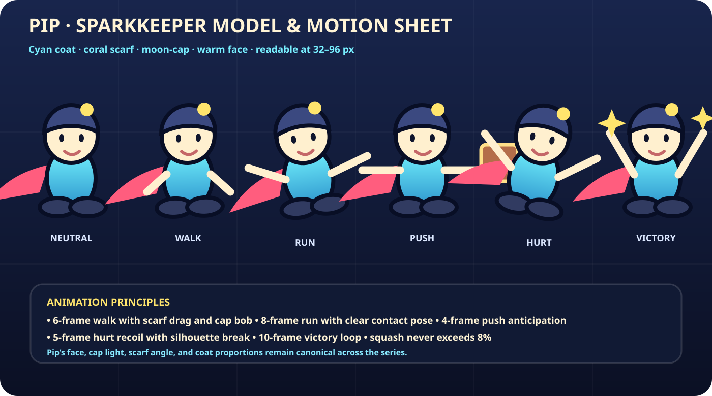

# Pip & the Prism Vault


**Pip & the Prism Vault** is the first game in the **Pip’s Pocket Worlds** series: a complete browser-based, single-screen puzzle arcade adventure inspired by the immediacy of classic 8-bit and 16-bit games, with an original hero, crisp cartoon vector art, comic-book storytelling, fluid turn animation, adaptive music, custom sound effects, visual effects, and a production-ready campaign structure.

The polished first pass contains **100 deterministic rooms across ten themed chapters**. It uses no stock packs, external art, licensed music, or temporary visual placeholders. Runtime graphics, character animation, enemies, environments, UI, VFX, music, and SFX are original and authored in this repository.

## Play locally

```bash
npm run serve
```

Open `http://localhost:4173`.

The game has no runtime dependencies and no build step. Any static host can serve it.

## Campaign

Pip is the smallest Sparkkeeper in the Prism Vault. When Baron Null fractures the Prism Heart and scatters its light through ten impossible museum wings, Pip must recover every Spark, read each room’s machinery, and bring morning back to the Vault.

Each room is a compact deterministic puzzle. Collect all three Prism Sparks, manipulate the chapter’s mechanisms, learn enemy movement rules, and reach the active lift. Turns are discrete for clarity, while movement, enemies, particles, screen effects, UI, and audio remain smooth and responsive.

### Ten chapters

1. **Clockwork Foyer** — patrol reading and movement fundamentals
2. **Mosslight Conservatory** — keys, locks, and route ordering
3. **Glacier Gallery** — crates, pressure plates, and persistent gates
4. **Ember Foundry** — ice lanes, spikes, and commitment
5. **Storm Laboratory** — conveyors, turrets, and rhythmic danger
6. **Infinite Library** — fragile floors, ghosts, and irreversible paths
7. **Moonlit Orrery** — paired teleport coils and spatial planning
8. **Sunken Aquarium** — water pockets, bridges, currents, and drones
9. **Obsidian Citadel** — layered combinations of established rules
10. **Prism Core** — mastery rooms and the Baron Null finale

The enemy roster includes scarabs, crawlers, slimes, hoppers, turrets, ghosts, mimics, and drones. Each family has a distinct silhouette, movement rule, timing profile, and audio/visual tell.

## Controls

| Action | Keyboard |
|---|---|
| Move | Arrow keys or WASD |
| Undo | Z or Backspace |
| Restart room | R |
| Hint | H |
| Pause | Escape or P |
| Toggle sound | M |
| Fullscreen | F |

Touch controls appear automatically on coarse-pointer devices.

## Production features

- 100 named single-screen rooms with chapter-specific progression and par targets
- 10 visual palettes and 10 adaptive musical arrangements
- 8 enemy families with deterministic movement and readable telegraphs
- keys and doors, crates and plates, gates, ice, conveyors, fragile floors, teleporters, spikes, water, and bridges
- multi-turn undo, instant restart, persistent progress, best-move records, and 1–3 star grades
- comic-book intro, key art, title menu, chapter directory, pause/options screens, victory, defeat, credits, and final ending
- synthesized Web Audio music and SFX with no downloaded audio assets
- reduced-motion, high-contrast, touch, keyboard, fullscreen, and sound options
- responsive 16:9 presentation with a fixed logical canvas for consistent composition

## Validation

```bash
npm run check
```

The automated campaign validator checks all 100 rooms for dimensions, unique names, legal placement, overlap rules, structural reachability, mechanic coverage, enemy coverage, and state-space mechanical solvability without relying on enemy luck.

## Repository map

- `src/game.js` — state machine, input, movement, undo, interactions, enemy AI, progression, VFX, and UI screens
- `src/levels.js` — ten world definitions and the complete deterministic 100-room campaign
- `src/art.js` — runtime vector drawing for Pip, enemies, tiles, comic panels, menus, and HUD
- `src/audio.js` — adaptive procedural score and original synthesized SFX
- `assets/` — editable key art, logo, app icon, and hero model sheet
- `docs/GAME_DESIGN.md` — complete game and series design foundation
- `docs/LEVEL_ATLAS.md` — room-by-room campaign atlas
- `docs/ART_AND_AUDIO.md` — visual, animation, UI, VFX, and audio bible
- `tests/validate-levels.mjs` — structural and mechanical campaign validation

## Original production art



The codebase separates campaign data, rendering, audio, and game state so Pip, the UI language, accessibility system, input layer, and production pipeline can be reused in future puzzle arcade and puzzle-platform entries.

## Deploy to Cloudflare

This repository deploys as a Cloudflare Worker with Static Assets. The production bundle is generated in `dist/`; source files remain outside the deployed asset directory.

```bash
npm install
npm run check
npx wrangler login
npm run deploy
```

Wrangler creates the `puzzleplatformer` Worker and prints the preview or production URL. For automated GitHub deployment, configure `CLOUDFLARE_API_TOKEN` and `CLOUDFLARE_ACCOUNT_ID` repository secrets before merging to `main`.

Local Cloudflare runtime:

```bash
npm install
npm run dev
```

The game is installable as a landscape PWA and caches its core shell for offline play after the first successful load.
