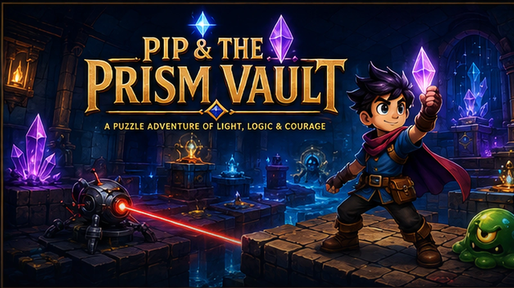
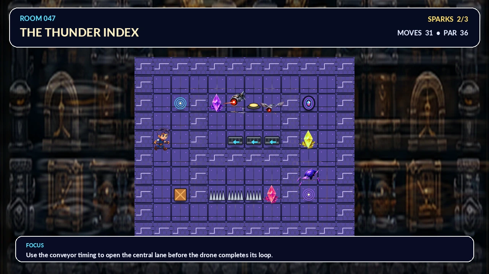

# Pip & the Prism Vault

**Production build 3.6 — commercial UI, persistent Vault secrets, resilient Cloudflare Pages delivery, offline recovery, accessibility, and release diagnostics**



**Pip & the Prism Vault** is a complete browser puzzle-arcade adventure with 100 explicitly authored single-screen rooms across ten themed chapters. It includes a five-panel comic opening, a production raster-art pipeline, deterministic enemy behavior, turn animation, synthesized Web Audio music and effects, persistent progress, keyboard/gamepad menus, objective-forward HUD telemetry, press-and-hold touch controls, reduced-motion/high-contrast modes, PWA installation, revisioned offline support, six solution-neutral Vault secrets, and a Cloudflare Pages production pipeline with post-deployment health checks.

## Run locally

```bash
npm ci --ignore-scripts
npm run build
npm run serve
```

Open `http://localhost:4173`.

For the Cloudflare Pages runtime:

```bash
npm run dev
```

## Deploy to the production Pages project

The primary deployment target is the existing `puzzleplatformer.pages.dev` project:

```bash
npm ci --ignore-scripts
npx wrangler login
npm run deploy
```

`wrangler.jsonc` is the source-of-truth Pages configuration and points at `./dist`. The production script uploads to the `puzzleplatformer` project on the `main` branch.

An optional Workers Static Assets preview remains available through a separate configuration and cannot accidentally replace the Pages deployment:

```bash
npm run deploy:worker
```

### GitHub Actions deployment

`.github/workflows/cloudflare.yml` validates, deploys to Cloudflare Pages, then checks both the immutable deployment URL and `https://puzzleplatformer.pages.dev`. Add these repository secrets:

- `CLOUDFLARE_API_TOKEN`
- `CLOUDFLARE_ACCOUNT_ID`

The production token needs Cloudflare Pages edit access. Deployments are serialized so two pushes cannot race each other.

## Deployment resilience

- A visible production boot screen reports individual asset-loading progress.
- Failed assets retry once before presenting a clear reload action.
- Service-worker updates produce an in-game reload prompt rather than silently replacing a running room.
- Installed builds can fall back to cached HTML when the network returns a transient 5xx response, including an origin-side 522.
- `dist/health.json` identifies the version, content revision, deployment target, and production asset count.
- `scripts/smoke-url.mjs` retries through propagation delays and verifies the shell, health payload, PWA manifest, service worker, and hero atlas.
- `_headers` supplies security policy and update-safe caching rules for Pages.

## Campaign

1. Clockwork Foyer — patrol reading and movement fundamentals
2. Mosslight Conservatory — keys, locks, and route ordering
3. Glacier Gallery — crates, pressure plates, and gates
4. Ember Foundry — ice lanes, spikes, and commitment
5. Storm Laboratory — conveyors, turrets, and rhythmic danger
6. Infinite Library — fragile floors, ghosts, and irreversible paths
7. Moonlit Orrery — paired teleport coils and spatial planning
8. Sunken Aquarium — hazards, bridges, currents, and drones
9. Obsidian Citadel — layered combinations of established rules
10. Prism Core — mastery rooms and the Baron Null finale

The enemy roster includes scarabs, crawlers, slimes, hoppers, turrets, drones, mimics, and ghosts.



## Production-art coverage

- 1600×900 cinematic key art and transparent production logo
- 24 illustrated, frame-aligned Pip animation frames
- 32 enemy animation frames across eight families
- 20 interactive-object sprites
- collectible, key, VFX, and UI atlases
- twenty floor/wall tiles across ten visual worlds
- ten 1280×720 illustrated chapter backdrops
- five cinematic comic panels
- PWA icons, maskable icons, install screenshots, favicon, and social-sharing image

The game blocks startup until every required production asset has loaded. Character, enemy, object, tile, backdrop, comic, logo, and UI placeholder renderers are not present in the shipping runtime.

## Controls

| Action | Keyboard | Gamepad |
|---|---|---|
| Move / navigate | Arrow keys / WASD | D-pad / left stick |
| Confirm | Enter / Space | A |
| Cycle menu focus | Tab / Shift+Tab | D-pad |
| Undo | Z / Backspace | B |
| Restart | R | X |
| Hint | H | Y |
| Pause | Escape / P | Start / Select |
| Sound | M | — |
| Fullscreen | F | — |

## Validation

```bash
npm run check
npx wrangler deploy --config wrangler.worker.jsonc --dry-run
```

The release gate verifies all 100 stored solutions, structural uniqueness, deterministic enemy safety, 32 production image files and 112 atlas cells, every shipping screen, absence of placeholder renderers, keyboard/gamepad/touch behavior, reduced motion, audio setup, Vault secrets, Pages configuration, visible boot/update states, 5xx cache recovery, generated health metadata, the exact `dist/` bundle, and a local Cloudflare Pages runtime smoke.

## Repository map

- `src/game.js` — game rules, interactions, enemy AI, progression, secrets, particles, and screens
- `src/room-data.js` — 100 explicit room definitions and verified solutions
- `src/assets.js` — progress-reporting, retrying production asset loader
- `src/art.js` — production atlas/backdrop renderer and UI composition
- `src/audio.js` — adaptive procedural score and synthesized effects
- `assets/commercial/` — shipping production assets
- `scripts/build.mjs` — deterministic Pages bundle and health metadata
- `scripts/smoke-url.mjs` — deployed URL health verification
- `tests/validate-deployment.mjs` — Pages/Workers separation and resilience gate
- `wrangler.jsonc` — production Cloudflare Pages configuration
- `wrangler.worker.jsonc` — optional Workers Static Assets preview configuration

## Vault secrets

Six persistent, solution-neutral easter eggs reward curiosity without changing puzzle state. Discoveries are recorded in the Credits ledger and include a C64-inspired archive display, title-screen rituals, a room-64 memory echo, a hidden Baron Null memo, and a full-mastery reward.
